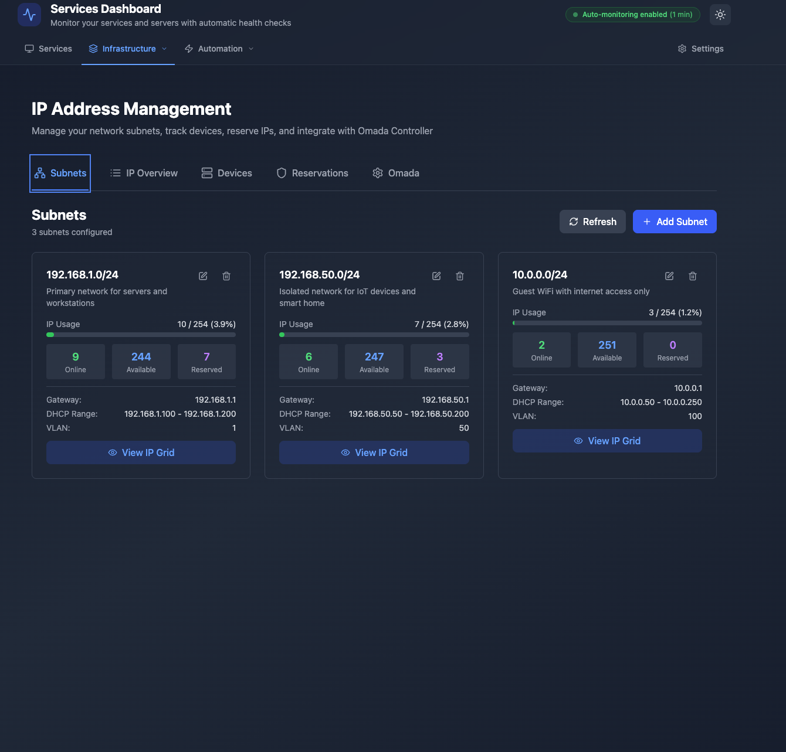
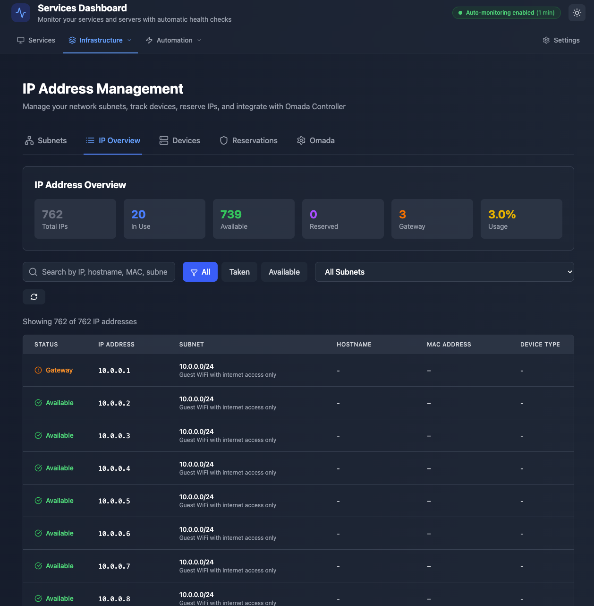
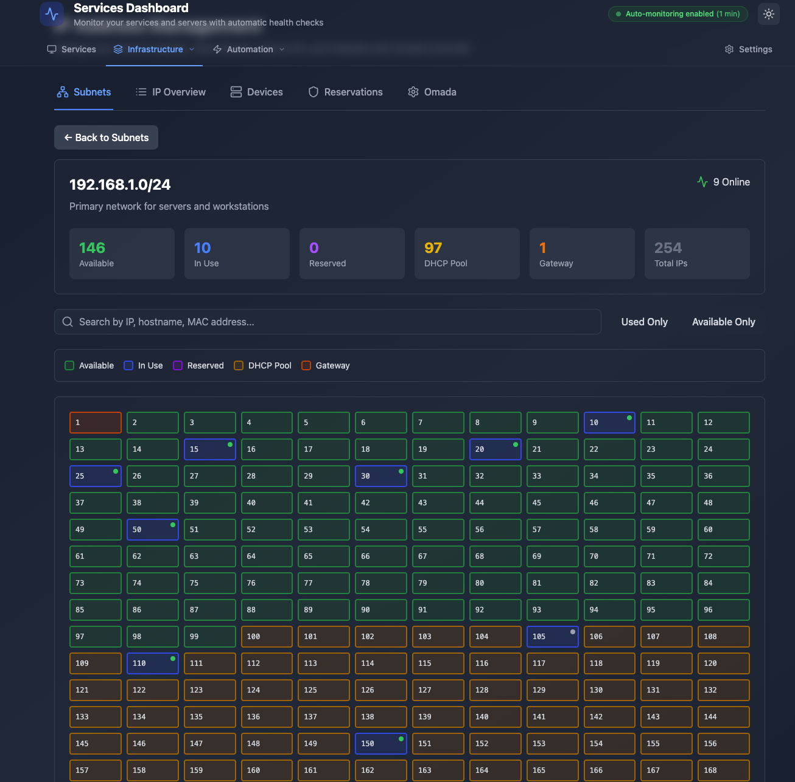

# Services Dashboard

A modern full-stack web application for monitoring and managing containerized services with AI-powered analysis, network discovery, and real-time log monitoring.


## ✨ Overview

Services Dashboard is a comprehensive monitoring solution that combines real-time service health monitoring with AI-powered insights. It features an intuitive React frontend, a robust .NET backend, and seamless Docker integration for easy deployment and development.

## ⚡ Quick Install

### One-Line Install (Linux/macOS/Raspberry Pi)

Get started in seconds with our automated installer. The installer will automatically:
- ✅ Detect your system architecture
- ✅ Check system requirements (RAM, dependencies)
- ✅ Install required .NET dependencies (ICU library, OpenSSL, CA certificates)
- ✅ Download and configure the application
- ✅ Set up systemd service for auto-start

**Raspberry Pi 3/4 (32-bit):**
```bash
curl -fsSL https://github.com/nickantoniadis/ServicesDashboard/releases/latest/download/servicesdashboard-pi-linux-arm.tar.gz | sudo tar -xzf - && sudo bash install.sh
```

> **⚠️ Raspberry Pi Zero / Pi 1 NOT Supported:** .NET 9.0 does not support ARMv6 architecture (Raspberry Pi Zero, Pi 1). Please use Raspberry Pi 3 or newer (ARMv7/ARMv8). The Pi Zero has only 512MB RAM which is also insufficient for .NET applications. Minimum recommended: **Raspberry Pi 3 with 1GB+ RAM**.

**For other platforms:**
```bash
# Raspberry Pi 3/4 (32-bit)
curl -fsSL https://github.com/nickantoniadis/ServicesDashboard/releases/latest/download/servicesdashboard-pi-linux-arm.tar.gz | sudo tar -xzf - && sudo bash install.sh

# Raspberry Pi 4/5 (64-bit)
curl -fsSL https://github.com/nickantoniadis/ServicesDashboard/releases/latest/download/servicesdashboard-pi-linux-arm64.tar.gz | sudo tar -xzf - && sudo bash install.sh

# Linux x64
curl -fsSL https://github.com/nickantoniadis/ServicesDashboard/releases/latest/download/servicesdashboard-linux-x64.tar.gz | sudo tar -xzf - && sudo bash install.sh

# macOS (Intel)
curl -fsSL https://github.com/nickantoniadis/ServicesDashboard/releases/latest/download/servicesdashboard-macos-x64.tar.gz | tar -xzf - && sudo bash install.sh

# macOS (Apple Silicon)
curl -fsSL https://github.com/nickantoniadis/ServicesDashboard/releases/latest/download/servicesdashboard-macos-arm64.tar.gz | tar -xzf - && sudo bash install.sh
```

> **Note:** Replace `nickantoniadis` with your GitHub username if different. For a specific version, replace `latest/download` with `download/v0.0.1` (or your version number).

**After installation:**
```bash
# Start the service
sudo systemctl start servicesdashboard

# Check status
sudo systemctl status servicesdashboard

# View logs
sudo journalctl -u servicesdashboard -f

# Access the dashboard
# Navigate to http://your-ip:5050
```

**For Windows:**
Download the latest release from [GitHub Releases](https://github.com/nickantoniadis/ServicesDashboard/releases/latest) and run `install.ps1` as Administrator.

### 🔧 Troubleshooting Installation

If you encounter issues during installation, try these solutions:

**ICU Library Missing Error (Raspberry Pi/Linux):**
```
Process terminated. Couldn't find a valid ICU package installed on the system.
```

**Solution:**
```bash
# Debian/Ubuntu/DietPi
sudo apt-get update
sudo apt-get install -y libicu-dev libssl-dev ca-certificates

# RHEL/CentOS/Fedora
sudo yum install -y icu openssl-libs ca-certificates

# Alpine Linux
sudo apk add --no-cache icu-libs libssl3 ca-certificates

# After installing dependencies, restart the service
sudo systemctl restart servicesdashboard
```

**Service Fails to Start:**
```bash
# Check detailed logs
sudo journalctl -u servicesdashboard -n 50 --no-pager

# Verify service file exists
sudo systemctl status servicesdashboard

# Check if port 5050 is already in use
sudo netstat -tlnp | grep 5050
```

**Insufficient Memory on Raspberry Pi:**
- Ensure you have at least 1GB RAM (Raspberry Pi 3 or newer)
- Close unnecessary services to free up memory
- Consider increasing swap space if needed

## 🚀 Key Features

### 📊 Service Management & Monitoring
- **Real-time Health Checks**: Continuous monitoring of service availability and response times
- **Docker Container Integration**: Native Docker container management and monitoring
- **Service Status Dashboard**: Visual indicators with uptime tracking and response metrics
- **Automated Health Detection**: Smart service health assessment with configurable thresholds


### 🔍 Intelligent Network Discovery
- **Network Range Scanning**: Comprehensive CIDR-based network discovery (e.g., `192.168.1.0/24`)
- **Single Host Analysis**: Detailed port scanning for individual hosts
- **Service Recognition**: Automatic identification of common services (HTTP, SSH, databases)
- **Banner Capture**: Service fingerprinting through banner analysis
- **One-Click Integration**: Add discovered services directly to your monitoring dashboard


### 🤖 AI-Powered Analysis
- **Ollama Integration**: Local AI model integration for intelligent log analysis
- **Smart Service Recognition**: AI-powered service type detection from network banners
- **Automated Issue Detection**: Intelligent problem identification and resolution suggestions
- **Log Pattern Analysis**: AI-driven insights from application logs
- **Service Screenshot Analysis**: Visual service monitoring and analysis

### 📝 Advanced Log Management
- **Real-time Log Streaming**: Live log collection from Docker containers
- **Remote Log Collection**: SSH-based log retrieval from remote servers
- **Multi-format Support**: Support for various log formats and sources
- **Advanced Filtering**: Search, filter, and export capabilities
- **Historical Analysis**: Log retention and historical trend analysis

[//]: # (![Log Analysis]&#40;./docs/images/log-analysis.png&#41;)

### 🎨 Modern User Experience
- **Responsive Design**: Optimized for desktop, tablet, and mobile devices
- **Dark/Light Themes**: Automatic theme detection with manual override
- **Real-time Updates**: Live data updates using React Query and WebSocket connections
- **Smooth Animations**: Polished UI transitions and micro-interactions
- **Accessibility**: WCAG compliant interface design

### 🖥️ Live Server Management and Problem Resolution

Comprehensive server infrastructure management with real-time monitoring and intelligent problem detection:

#### Server Monitoring & Health Tracking
- **Multi-Server Dashboard**: Monitor multiple servers from a single interface
- **Real-time Health Metrics**: Live tracking of CPU, memory, disk usage, and system load
- **Health Check History**: Historical health data with trend analysis and visualization
- **Status Classification**: Online, Warning, Critical, Offline, and Maintenance states
- **Server Groups**: Organize servers into logical groups (Production, Edge Devices, Remote, etc.)
- **Server Types**: Support for physical servers, VMs, Raspberry Pi devices, and containers

#### Update Management & Security
- **Automated Update Detection**: Periodic checks for system and security updates
- **Security Patch Tracking**: Monitor critical security patches and vulnerabilities
- **Update Reports**: Detailed reports showing available updates with severity levels
- **Update History**: Track update installation history and success rates
- **One-Click Updates**: Execute system updates directly from the dashboard

#### Alert Management & Notifications
- **Active Alert Monitoring**: Real-time display of server alerts and warnings
- **Alert Severity Levels**: Low, Medium, High, and Critical classification
- **Alert History**: Complete audit trail of all server alerts
- **Alert Resolution Tracking**: Monitor alert lifecycle from detection to resolution
- **Custom Alert Rules**: Configure custom thresholds for CPU, memory, and disk alerts

#### 🤖 AI-Powered Log Analysis
- **Real-time Log Viewing**: Stream and view server logs in real-time
- **Multi-Source Log Collection**: Support for Docker containers, SSH remote logs, and local files
- **AI Log Analysis**: Intelligent analysis of log patterns using Ollama integration
  - **Automatic Issue Detection**: Identifies performance, memory, security, and application issues
  - **Severity Classification**: Categorizes issues as Low, Medium, High, or Critical
  - **Actionable Recommendations**: Provides specific remediation steps for detected problems
  - **Confidence Scoring**: AI confidence levels for each analysis result
  - **Context-Aware Analysis**: Tailored insights based on server role and configuration
- **Log Filtering & Search**: Advanced search and filtering capabilities
- **Log Export**: Export logs for offline analysis and reporting

#### Remote Management Capabilities
- **SSH Command Execution**: Execute commands on remote servers via secure SSH
- **Connection Testing**: Verify server connectivity and SSH access
- **Credential Management**: Secure storage of server SSH credentials
- **Batch Operations**: Execute commands across multiple servers simultaneously
- **Command History**: Track executed commands and their results

#### Server Relationship Management
- **Parent-Child Hierarchies**: Define and visualize server relationships
- **Dependency Tracking**: Monitor service dependencies between servers
- **Cascading Health Checks**: Propagate health status through server hierarchies
- **Group Management**: Organize servers by environment, location, or function

#### Platform Support
- **Linux Servers**: Full support for Debian, Ubuntu, CentOS, RHEL, and other distributions
- **Raspberry Pi**: Native support for Pi 3, Pi 4, and Pi 5 devices (ARMv7/ARMv8)
- **Virtual Machines**: VMware, Proxmox, VirtualBox, and cloud VMs
- **Container Hosts**: Docker hosts and container orchestration platforms
- **macOS and Windows**: Cross-platform server management


### 🌐 IP Address Management (NEW!)

Comprehensive IP address management system for tracking, organizing, and managing your network infrastructure:

#### Network Subnet Management
- **Subnet Configuration**: Manage multiple subnets with CIDR notation (e.g., `192.168.1.0/24`)
- **DHCP Range Tracking**: Configure and monitor DHCP IP ranges
- **Gateway Management**: Define and track gateway addresses for each subnet
- **VLAN Support**: Organize subnets by VLAN IDs
- **Usage Statistics**: Real-time IP utilization tracking with visual indicators
- **DNS Configuration**: Configure DNS servers per subnet



#### IP Address Tracking
- **IP Overview Dashboard**: Comprehensive view of all IP addresses across all subnets
  - Visual status indicators (Available, In Use, Reserved, DHCP Pool, Gateway)
  - Advanced filtering by status, subnet, and search criteria
  - Detailed device information including hostname, MAC address, and device type
  - Real-time availability tracking
- **IP Grid Visualization**: Color-coded grid view of IP addresses
  - 🟢 Green: Available IPs ready for assignment
  - 🔵 Blue: In Use by active devices
  - 🟣 Purple: Reserved for specific purposes
  - 🟡 Yellow: DHCP pool range
  - 🟠 Orange: Gateway addresses
- **Conflict Detection**: Automatic detection of IP address conflicts
- **Next Available IP**: Smart algorithm to find the next available IP, avoiding DHCP ranges




#### Device Management
- **Device Discovery**: Track all network devices across your infrastructure
- **MAC Address Tracking**: Link devices to their physical MAC addresses
- **Device Classification**: Categorize devices by type (Computer, Server, Phone, IoT, Printer, etc.)
- **Status Monitoring**: Real-time online/offline status tracking
- **Device History**: Complete audit trail of all device changes and events
- **Multi-Source Discovery**: Support for network scans, Omada Controller, manual entry, SNMP, and ARP tables

#### IP Reservations
- **Static IP Management**: Reserve IP addresses for specific devices or purposes
- **MAC Binding**: Lock reservations to specific MAC addresses
- **Expiration Dates**: Set temporary reservations with automatic expiration
- **Purpose Tracking**: Document the reason and assignment for each reservation
- **Active/Inactive States**: Enable or disable reservations as needed

#### TP-Link Omada Integration
- **Omada Controller Sync**: Connect to TP-Link Omada Controller for automatic client discovery
- **DHCP Lease Information**: Pull DHCP lease data directly from your controller
- **Automatic Synchronization**: Schedule periodic syncs to keep device lists up-to-date
- **Multi-Controller Support**: Manage multiple Omada controllers from one dashboard
- **Connection Testing**: Verify Omada controller connectivity before syncing

## 🚀 Upcoming Features

### Network Management
- [ ] **Device Tracker Completion**: Full device list management with advanced filtering and bulk operations
- [ ] **Reservation Manager**: Complete UI for creating, editing, and managing IP reservations
- [ ] **Omada Configuration UI**: Full interface for configuring Omada Controller integration
- [ ] **Network Topology Map**: Visual representation of network layout and device relationships
- [ ] **Subnet Calculator**: Built-in calculator for network planning and IP allocation
- [ ] **MAC Address Vendor Lookup**: Automatic vendor identification from MAC addresses
- [ ] **DNS Integration**: Automatic DNS record management and synchronization
- [ ] **IPAM Export/Import**: Bulk import/export of IP data in CSV/JSON formats

### Monitoring & Alerts
- [ ] **IP Utilization Alerts**: Notifications when subnet usage exceeds thresholds
- [ ] **Device Change Notifications**: Alerts for new devices, changes, or disconnections
- [ ] **Conflict Alerts**: Real-time notifications for IP address conflicts
- [ ] **Custom Alert Rules**: User-defined rules for network monitoring
- [ ] **Alert Dashboard**: Centralized view of all network alerts and events
- [ ] **Email/Webhook Notifications**: External notification support for critical events

### Analytics & Reporting
- [ ] **Historical IP Usage**: Track IP allocation trends over time
- [ ] **Device Connection Patterns**: Analyze device connectivity patterns
- [ ] **Subnet Growth Planning**: Predictive analytics for subnet capacity planning
- [ ] **Custom Reports**: Generate detailed reports on network utilization
- [ ] **Export Capabilities**: PDF/CSV export for all reports and dashboards
- [ ] **Compliance Reports**: Network documentation for audit purposes

### Service Management Enhancements
- [ ] **Service Dependency Mapping**: Visual representation of service dependencies
- [ ] **Advanced Health Metrics**: More granular health indicators (CPU, Memory, Disk, Network)
- [ ] **Performance Trends**: Historical performance analysis with graphs and charts
- [ ] **Predictive Alerts**: AI-powered prediction of potential service failures
- [ ] **Custom Health Check Scripts**: User-defined health check logic
- [ ] **Service Groups**: Organize services into logical groups for batch operations

### Deployment & Automation
- [ ] **CI/CD Pipeline Integration**: Direct integration with Jenkins, GitLab CI, GitHub Actions
- [ ] **Automated Rollback**: Automatic rollback on deployment failure detection
- [ ] **Blue-Green Deployments**: Zero-downtime deployment strategies
- [ ] **Canary Releases**: Gradual rollout with automatic traffic shifting
- [ ] **Deployment Templates**: Reusable deployment configurations
- [ ] **Multi-Environment Management**: Dev, Staging, Production environment separation

### Security & Compliance
- [ ] **Vulnerability Scanning**: Integration with vulnerability scanners (Trivy, Clair)
- [ ] **Security Audit Logs**: Comprehensive audit trail for all operations
- [ ] **Role-Based Access Control (RBAC)**: User permissions and access management
- [ ] **Two-Factor Authentication**: Enhanced security for user accounts
- [ ] **API Key Management**: Secure API access with key rotation
- [ ] **Compliance Dashboard**: Security compliance tracking and reporting

### Integration & API
- [ ] **REST API Documentation**: Interactive API documentation with Swagger/OpenAPI
- [ ] **Webhook Support**: Event-driven webhooks for external integrations
- [ ] **Prometheus Integration**: Metrics export for Prometheus monitoring
- [ ] **Grafana Dashboards**: Pre-built dashboards for Grafana
- [ ] **Slack/Teams Integration**: Real-time notifications to chat platforms
- [ ] **Custom Plugin System**: Extensible plugin architecture for custom features

### AI & Machine Learning
- [ ] **Anomaly Detection**: ML-based detection of unusual patterns and behaviors
- [ ] **Log Clustering**: Automatic grouping of similar log entries
- [ ] **Root Cause Analysis**: AI-powered identification of issue root causes
- [ ] **Capacity Planning**: ML predictions for resource capacity needs
- [ ] **Smart Recommendations**: AI-suggested optimizations and improvements
- [ ] **Natural Language Queries**: Ask questions about your infrastructure in plain English

### Mobile & Accessibility
- [ ] **Progressive Web App (PWA)**: Installable mobile app experience
- [ ] **Push Notifications**: Mobile push notifications for critical events
- [ ] **Offline Mode**: Basic functionality when offline
- [ ] **Accessibility Improvements**: Full WCAG 2.1 AAA compliance
- [ ] **Voice Commands**: Voice-controlled dashboard navigation
- [ ] **Multi-Language Support**: Internationalization with multiple language options

### Platform Expansion
- [ ] **Kubernetes Integration**: Native K8s cluster monitoring and management
- [ ] **AWS/Azure/GCP Support**: Cloud provider integration for hybrid environments
- [ ] **Container Orchestration**: Support for Docker Swarm, Nomad, etc.
- [ ] **Edge Computing**: Enhanced support for edge devices and IoT
- [ ] **Multi-Tenant Architecture**: Support for multiple organizations/teams
- [ ] **High Availability Mode**: Clustered deployment for enterprise environments

## 🙋‍♂️ Support & Community
### Getting Help
- **📚 Documentation**: Comprehensive guides in the [wiki](https://github.com/devblaze/ServicesDashboard/wiki)
- **🐛 Bug Reports**: Open an [issue](https://github.com/devblaze/ServicesDashboard/issues) for bugs
- **💡 Feature Requests**: Suggest new features via [issues](https://github.com/devblaze/ServicesDashboard/issues)
- **💬 Discussions**: Ask questions in [GitHub Discussions](https://github.com/devblaze/ServicesDashboard/discussions)

### Community Guidelines
- Be respectful and constructive
- Search existing issues before creating new ones
- Provide detailed information for bug reports
- Follow the issue templates when available

## 🤝 Contributing
### Development Setup
1. **Fork the repository** on GitHub
2. **Clone your fork:**
```bash
   git clone https://github.com/devblaze/ServicesDashboard.git
   cd ServicesDashboard
```
1. **Create a feature branch:**
```bash
   git checkout -b feature/amazing-new-feature
```
1. **Set up development environment:**
```bash
   # Start development services
   docker-compose -f compose.local.yaml up -d
   
   # Install frontend dependencies
   cd services-dashboard-frontend && npm install
   
   # Restore backend packages
   cd ../ServicesDashboard && dotnet restore
```
### Development Guidelines
- **Code Style**: Follow established patterns and formatting rules
- **Testing**: Add tests for new features and bug fixes
- **Documentation**: Update README and inline documentation
- **Docker**: Ensure both local and containerized setups work
- **TypeScript**: Maintain type safety in frontend code
- **API**: Follow RESTful API design principles

### Pull Request Process
1. **Update documentation** for any new features
2. **Add or update tests** as needed
3. **Ensure all tests pass** locally
4. **Update the [CHANGELOG.md](CHANGELOG.md)** with your changes in the [Unreleased] section
5. **Submit pull request** with detailed description

### Code Review Criteria
- Code follows project conventions
- Tests are comprehensive and pass
- Documentation is updated
- No breaking changes (or properly documented)
- Security considerations are addressed

**🚀 Built with ❤️ using .NET 9, React 19, and modern cloud-native technologies.**
_Ready to revolutionize your service monitoring? Get started in under 5 minutes with Docker Compose!_

## 📝 License
This project is licensed under the **MIT License** - see the [LICENSE](LICENSE) file for complete details.
