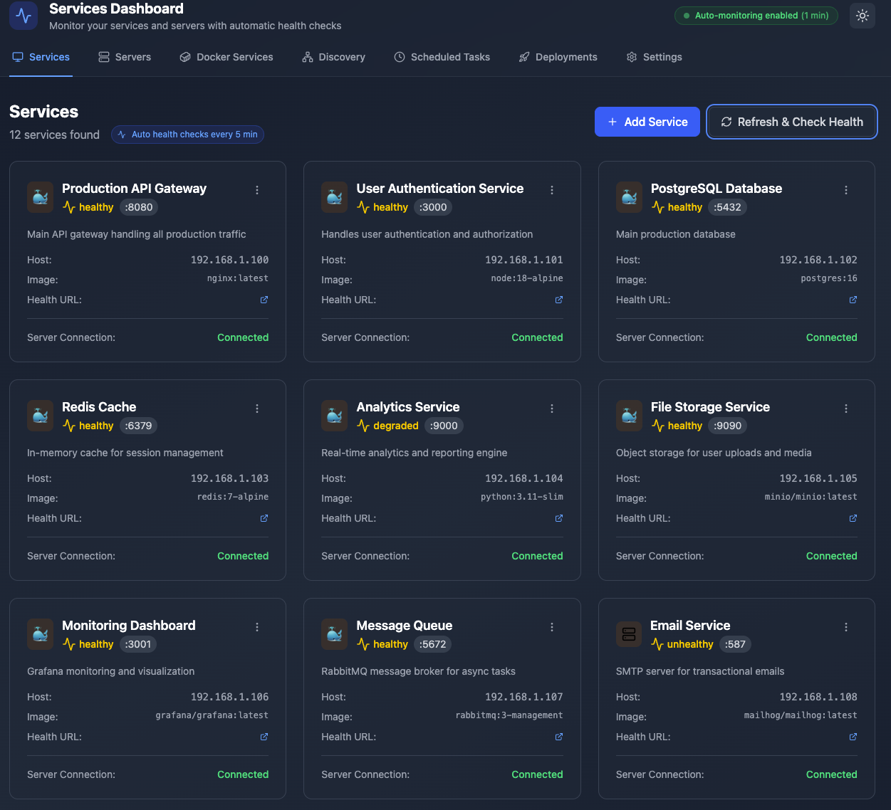
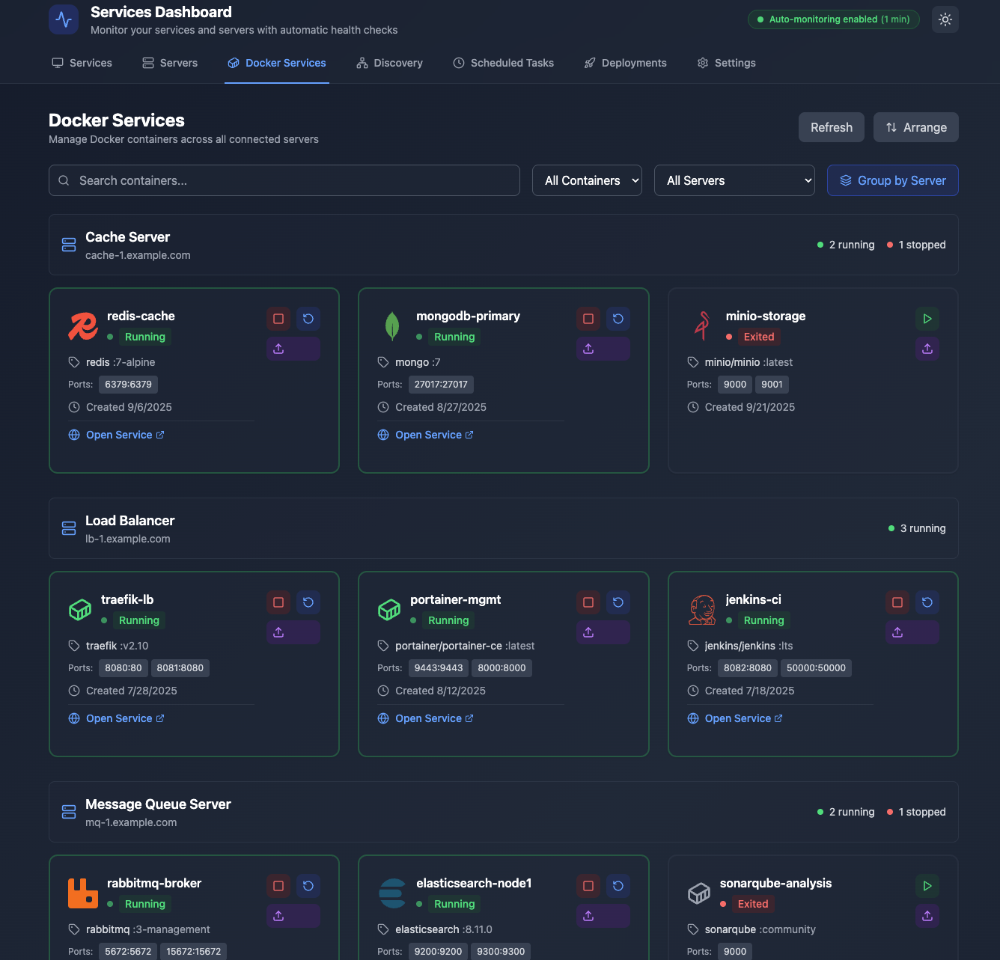
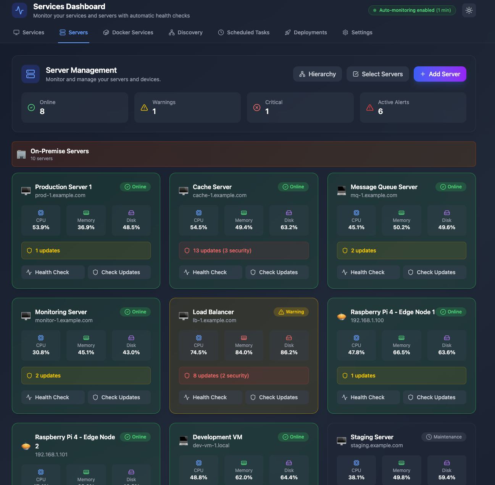

# Services Dashboard

A modern full-stack web application for monitoring and managing containerized services with AI-powered analysis, network discovery, and real-time log monitoring.



## ✨ Overview

Services Dashboard is a comprehensive monitoring solution that combines real-time service health monitoring with AI-powered insights. It features an intuitive React frontend, a robust .NET backend, and seamless Docker integration for easy deployment and development.

## ⚡ Quick Install

### One-Line Install (Linux/macOS/Raspberry Pi)

Get started in seconds with our automated installer:

**Raspberry Pi 3/4 (32-bit):**
```bash
curl -fsSL https://github.com/nickantoniadis/ServicesDashboard/releases/latest/download/servicesdashboard-pi-linux-arm.tar.gz | sudo tar -xzf - && sudo bash install.sh
```

> **⚠️ Raspberry Pi Zero / Pi 1 NOT Supported:** .NET 9.0 does not support ARMv6 architecture (Raspberry Pi Zero, Pi 1). Please use Raspberry Pi 3 or newer (ARMv7/ARMv8). The Pi Zero has only 512MB RAM which is also insufficient for .NET applications. Minimum recommended: **Raspberry Pi 3 with 1GB+ RAM**.

**For other platforms:**
```bash
# Raspberry Pi 3/4 (32-bit)
curl -fsSL https://github.com/nickantoniadis/ServicesDashboard/releases/latest/download/servicesdashboard-pi-linux-arm.tar.gz | sudo tar -xzf - && sudo bash install.sh

# Raspberry Pi 4/5 (64-bit)
curl -fsSL https://github.com/nickantoniadis/ServicesDashboard/releases/latest/download/servicesdashboard-pi-linux-arm64.tar.gz | sudo tar -xzf - && sudo bash install.sh

# Linux x64
curl -fsSL https://github.com/nickantoniadis/ServicesDashboard/releases/latest/download/servicesdashboard-linux-x64.tar.gz | sudo tar -xzf - && sudo bash install.sh

# macOS (Intel)
curl -fsSL https://github.com/nickantoniadis/ServicesDashboard/releases/latest/download/servicesdashboard-macos-x64.tar.gz | tar -xzf - && sudo bash install.sh

# macOS (Apple Silicon)
curl -fsSL https://github.com/nickantoniadis/ServicesDashboard/releases/latest/download/servicesdashboard-macos-arm64.tar.gz | tar -xzf - && sudo bash install.sh
```

> **Note:** Replace `nickantoniadis` with your GitHub username if different. For a specific version, replace `latest/download` with `download/v0.0.1` (or your version number).

**After installation:**
```bash
# Start the service
sudo systemctl start servicesdashboard

# Check status
sudo systemctl status servicesdashboard

# View logs
sudo journalctl -u servicesdashboard -f

# Access the dashboard
# Navigate to http://your-ip:5050
```

**For Windows:**
Download the latest release from [GitHub Releases](https://github.com/nickantoniadis/ServicesDashboard/releases/latest) and run `install.ps1` as Administrator.

## 🚀 Key Features

### 📊 Service Management & Monitoring
- **Real-time Health Checks**: Continuous monitoring of service availability and response times
- **Docker Container Integration**: Native Docker container management and monitoring
- **Service Status Dashboard**: Visual indicators with uptime tracking and response metrics
- **Automated Health Detection**: Smart service health assessment with configurable thresholds



### 🔍 Intelligent Network Discovery
- **Network Range Scanning**: Comprehensive CIDR-based network discovery (e.g., `192.168.1.0/24`)
- **Single Host Analysis**: Detailed port scanning for individual hosts
- **Service Recognition**: Automatic identification of common services (HTTP, SSH, databases)
- **Banner Capture**: Service fingerprinting through banner analysis
- **One-Click Integration**: Add discovered services directly to your monitoring dashboard


### 🤖 AI-Powered Analysis
- **Ollama Integration**: Local AI model integration for intelligent log analysis
- **Smart Service Recognition**: AI-powered service type detection from network banners
- **Automated Issue Detection**: Intelligent problem identification and resolution suggestions
- **Log Pattern Analysis**: AI-driven insights from application logs
- **Service Screenshot Analysis**: Visual service monitoring and analysis

### 📝 Advanced Log Management
- **Real-time Log Streaming**: Live log collection from Docker containers
- **Remote Log Collection**: SSH-based log retrieval from remote servers
- **Multi-format Support**: Support for various log formats and sources
- **Advanced Filtering**: Search, filter, and export capabilities
- **Historical Analysis**: Log retention and historical trend analysis

[//]: # (![Log Analysis]&#40;./docs/images/log-analysis.png&#41;)

### 🎨 Modern User Experience
- **Responsive Design**: Optimized for desktop, tablet, and mobile devices
- **Dark/Light Themes**: Automatic theme detection with manual override
- **Real-time Updates**: Live data updates using React Query and WebSocket connections
- **Smooth Animations**: Polished UI transitions and micro-interactions
- **Accessibility**: WCAG compliant interface design

### 🖥️ Live Server Management and Problem Resolution

Comprehensive server infrastructure management with real-time monitoring and intelligent problem detection:

#### Server Monitoring & Health Tracking
- **Multi-Server Dashboard**: Monitor multiple servers from a single interface
- **Real-time Health Metrics**: Live tracking of CPU, memory, disk usage, and system load
- **Health Check History**: Historical health data with trend analysis and visualization
- **Status Classification**: Online, Warning, Critical, Offline, and Maintenance states
- **Server Groups**: Organize servers into logical groups (Production, Edge Devices, Remote, etc.)
- **Server Types**: Support for physical servers, VMs, Raspberry Pi devices, and containers

#### Update Management & Security
- **Automated Update Detection**: Periodic checks for system and security updates
- **Security Patch Tracking**: Monitor critical security patches and vulnerabilities
- **Update Reports**: Detailed reports showing available updates with severity levels
- **Update History**: Track update installation history and success rates
- **One-Click Updates**: Execute system updates directly from the dashboard

#### Alert Management & Notifications
- **Active Alert Monitoring**: Real-time display of server alerts and warnings
- **Alert Severity Levels**: Low, Medium, High, and Critical classification
- **Alert History**: Complete audit trail of all server alerts
- **Alert Resolution Tracking**: Monitor alert lifecycle from detection to resolution
- **Custom Alert Rules**: Configure custom thresholds for CPU, memory, and disk alerts

#### 🤖 AI-Powered Log Analysis
- **Real-time Log Viewing**: Stream and view server logs in real-time
- **Multi-Source Log Collection**: Support for Docker containers, SSH remote logs, and local files
- **AI Log Analysis**: Intelligent analysis of log patterns using Ollama integration
  - **Automatic Issue Detection**: Identifies performance, memory, security, and application issues
  - **Severity Classification**: Categorizes issues as Low, Medium, High, or Critical
  - **Actionable Recommendations**: Provides specific remediation steps for detected problems
  - **Confidence Scoring**: AI confidence levels for each analysis result
  - **Context-Aware Analysis**: Tailored insights based on server role and configuration
- **Log Filtering & Search**: Advanced search and filtering capabilities
- **Log Export**: Export logs for offline analysis and reporting

#### Remote Management Capabilities
- **SSH Command Execution**: Execute commands on remote servers via secure SSH
- **Connection Testing**: Verify server connectivity and SSH access
- **Credential Management**: Secure storage of server SSH credentials
- **Batch Operations**: Execute commands across multiple servers simultaneously
- **Command History**: Track executed commands and their results

#### Server Relationship Management
- **Parent-Child Hierarchies**: Define and visualize server relationships
- **Dependency Tracking**: Monitor service dependencies between servers
- **Cascading Health Checks**: Propagate health status through server hierarchies
- **Group Management**: Organize servers by environment, location, or function

#### Platform Support
- **Linux Servers**: Full support for Debian, Ubuntu, CentOS, RHEL, and other distributions
- **Raspberry Pi**: Native support for Pi 3, Pi 4, and Pi 5 devices (ARMv7/ARMv8)
- **Virtual Machines**: VMware, Proxmox, VirtualBox, and cloud VMs
- **Container Hosts**: Docker hosts and container orchestration platforms
- **macOS and Windows**: Cross-platform server management



## 🙋‍♂️ Support & Community
### Getting Help
- **📚 Documentation**: Comprehensive guides in the [wiki](https://github.com/devblaze/ServicesDashboard/wiki)
- **🐛 Bug Reports**: Open an [issue](https://github.com/devblaze/ServicesDashboard/issues) for bugs
- **💡 Feature Requests**: Suggest new features via [issues](https://github.com/devblaze/ServicesDashboard/issues)
- **💬 Discussions**: Ask questions in [GitHub Discussions](https://github.com/devblaze/ServicesDashboard/discussions)

### Community Guidelines
- Be respectful and constructive
- Search existing issues before creating new ones
- Provide detailed information for bug reports
- Follow the issue templates when available

## 🤝 Contributing
### Development Setup
1. **Fork the repository** on GitHub
2. **Clone your fork:**
```bash
   git clone https://github.com/devblaze/ServicesDashboard.git
   cd ServicesDashboard
```
1. **Create a feature branch:**
```bash
   git checkout -b feature/amazing-new-feature
```
1. **Set up development environment:**
```bash
   # Start development services
   docker-compose -f compose.local.yaml up -d
   
   # Install frontend dependencies
   cd services-dashboard-frontend && npm install
   
   # Restore backend packages
   cd ../ServicesDashboard && dotnet restore
```
### Development Guidelines
- **Code Style**: Follow established patterns and formatting rules
- **Testing**: Add tests for new features and bug fixes
- **Documentation**: Update README and inline documentation
- **Docker**: Ensure both local and containerized setups work
- **TypeScript**: Maintain type safety in frontend code
- **API**: Follow RESTful API design principles

### Pull Request Process
1. **Update documentation** for any new features
2. **Add or update tests** as needed
3. **Ensure all tests pass** locally
4. **Update the CHANGELOG** with your changes
5. **Submit pull request** with detailed description

### Code Review Criteria
- Code follows project conventions
- Tests are comprehensive and pass
- Documentation is updated
- No breaking changes (or properly documented)
- Security considerations are addressed

**🚀 Built with ❤️ using .NET 9, React 19, and modern cloud-native technologies.**
_Ready to revolutionize your service monitoring? Get started in under 5 minutes with Docker Compose!_

## 📝 License
This project is licensed under the **MIT License** - see the [LICENSE](LICENSE) file for complete details.
